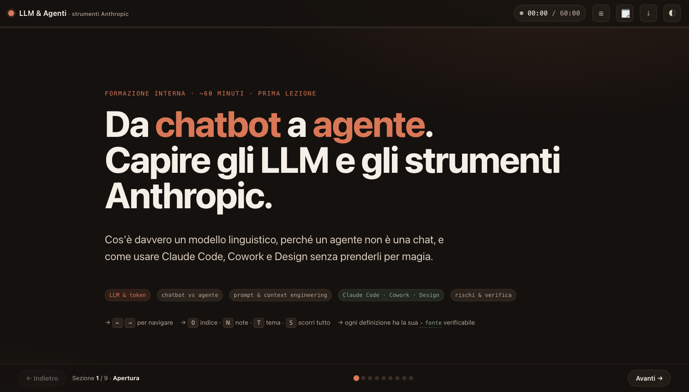
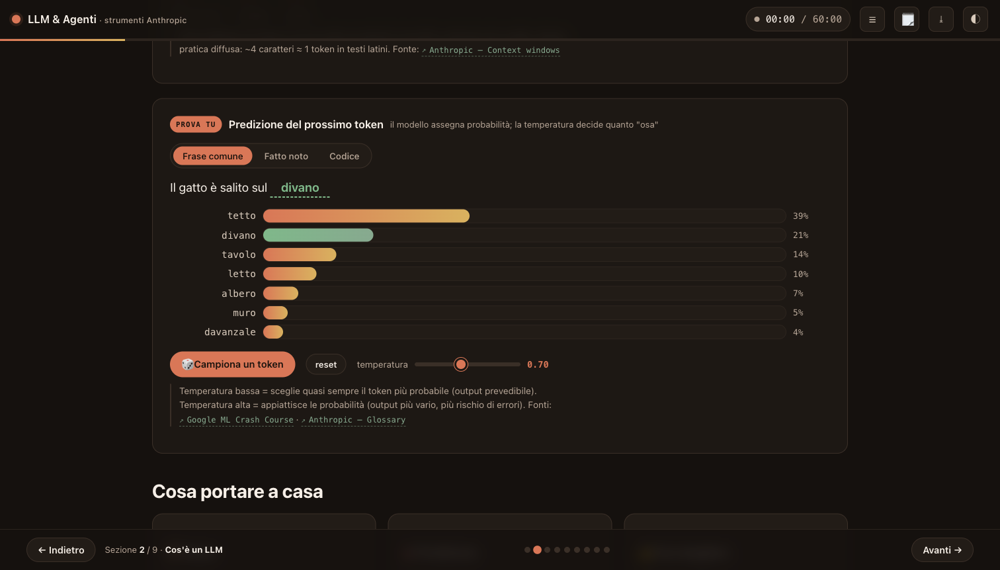

# Corso · LLM, Agenti e gli strumenti Anthropic

**▶ Demo live: <https://matteoscurati.github.io/cc-claude-course/>**



Mini-sito **interattivo** per una lezione di formazione dal vivo (~60 minuti) su
cosa sia un LLM, la differenza tra chatbot e agenti, e gli strumenti Anthropic
(**Claude Code, Cowork, Design**). Pensato come supporto da proiettare durante la call.

Ogni definizione è ancorata a una **fonte ufficiale verificabile** (88 citazioni
inline + bibliografia finale), così i partecipanti possono controllare in autonomia.

> Niente dipendenze, niente build, niente backend: si apre con un doppio clic e
> funziona **offline**. Il sito stesso è un esempio di "artifact" interattivo.



*Esempio di momento interattivo: la predizione del prossimo token, con le probabilità a barre e la temperatura regolabile dal vivo.*

---

## Come si usa

**Opzione 1 — doppio clic**
Apri `site/index.html` nel browser.

**Opzione 2 — server statico locale** (consigliata)
```bash
cd site
python3 -m http.server
# poi apri http://localhost:8000
```

### Scorciatoie da tastiera (per il relatore)
| Tasto | Azione |
| --- | --- |
| `←` / `→` (o `Spazio`) | slide precedente / successiva |
| `1`–`9` | vai alla sezione |
| `O` | indice delle sezioni |
| `N` | note del relatore |
| `T` | tema chiaro / scuro |
| `S` | modalità scorrimento (tutto in una pagina) |
| clic sul cronometro | avvia/ferma il timer della lezione (target 60′) |

---

## Struttura della lezione (11 sezioni)

| # | Sezione | Durata | Momenti interattivi |
| --- | --- | --- | --- |
| 1 | Cos'è un LLM | 8′ | tokenizer live · predizione next-token con slider temperatura |
| 2 | Inferenza & modelli | 7′ | model chooser Opus/Sonnet/Haiku · barre capacità/velocità/costo |
| 3 | Da chat ad agente | 8′ | diagramma del loop chatbot vs agente, passo-passo |
| 4 | Prompt & Context engineering | 10′ | prompt builder · misuratore del costo del contesto |
| 5 | Mappa Claude: Chat/Code/Cowork/Design | 14′ | card espandibili · Artifacts · permission modes · Goal/Loop/Workflow |
| 6 | Skills, Subagents, Hooks & MCP | 9′ | "quale meccanismo mi serve?" · connectors map |
| 7 | Focus: Claude Cowork (configurazione) | 8′ | setup connettori/istruzioni/skill/plugin · 5 «ingredienti» · permessi & governance |
| 8 | CLI: confronto & uso | 8′ | matrice per profilo · terminale interattivo |
| 9 | Rischi, verifica & framework 4D | 5′ | ruota 4D cliccabile |
| 10 | Cosa possiamo fare in Cantiere Creativo | 6′ | persona · produzione/offerta · servizi futuri |
| 11 | Sintesi · Glossario · Fonti | — | glossario ricercabile · bibliografia completa |

---

## Struttura del repo

```
.
├── site/                  # il mini-sito (vanilla HTML/CSS/JS, zero dipendenze)
│   ├── index.html         # contenuti e definizioni con fonti inline
│   ├── styles.css         # design system (dark/light, ottimizzato per proiezione)
│   └── script.js          # engine del deck + tutti i widget interattivi
├── research/              # materiale di ricerca e fonti certificate
│   ├── certified-sources.md   # bibliografia verificata (solo fonti ufficiali)
│   ├── lesson-structure.md    # scaletta didattica di riferimento
│   └── claude-corpus.md       # corpus di contenuti sugli strumenti Claude
├── README.md
└── LICENSE
```

## Fonti

Tutte le definizioni citano documentazione ufficiale di Anthropic, OpenAI, Google e
Microsoft, paper primari (es. *Attention Is All You Need*) e corsi universitari.
L'elenco completo e i criteri di selezione sono in
[`research/certified-sources.md`](research/certified-sources.md).

## Licenza

Materiale rilasciato sotto **[CC BY 4.0](LICENSE)** — libero di riusare e adattare
citando la fonte. Le risorse di terze parti linkate restano dei rispettivi proprietari.

---

*Costruito con Claude Code per la formazione interna di Cantiere Creativo.*
