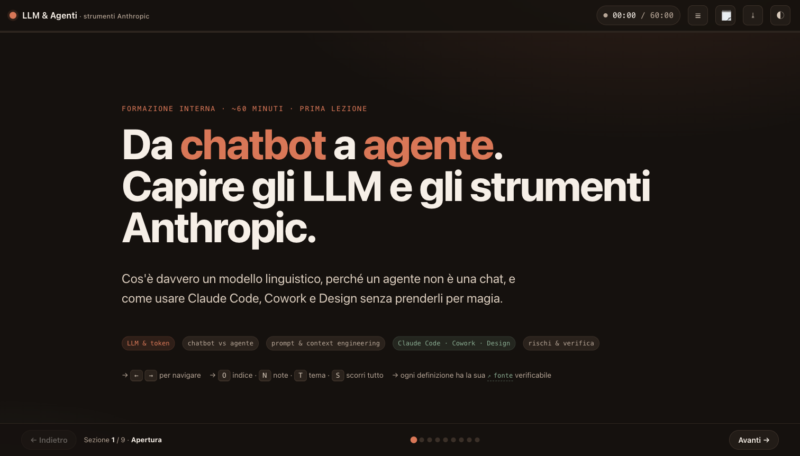
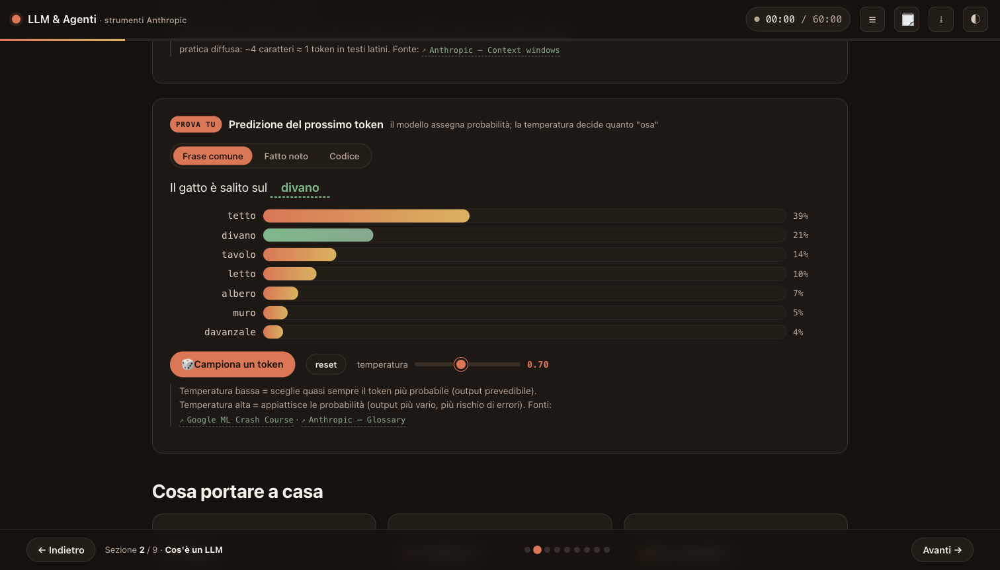

# Corso · LLM, Agenti e gli strumenti Anthropic

**▶ Demo live: <https://matteoscurati.github.io/cc-claude-course/>** (hub con le due sessioni)

## Sessioni

| Data | Sessione | Deck | Materiali |
| --- | --- | --- | --- |
| giugno 2026 | Lezione 1 · Da chatbot ad agente (~60′, 11 sezioni) | [`site/`](site/index.html) | [`research/lesson-structure.md`](research/lesson-structure.md) |
| 16 settembre 2026 | Update · modelli USA e Cina, harness, orchestrazione, Claude Design (60′, 7 sezioni, 3 demo) | [`sessioni/2026-09-16-17/deck/`](sessioni/2026-09-16-17/deck/index.html) | [programma](sessioni/2026-09-16-17/index.html) della due giorni 16–17/09 (anche in [`programma.md`](sessioni/2026-09-16-17/programma.md)) · [`research/lesson-structure-2026-09.md`](research/lesson-structure-2026-09.md) |

Il resto di questo README descrive la lezione 1; la sessione di settembre è documentata più sotto.



Mini-sito **interattivo** per una lezione di formazione dal vivo (~60 minuti) su
cosa sia un LLM, la differenza tra chatbot e agenti, e gli strumenti Anthropic
(**Claude Code, Cowork, Design**). Pensato come supporto da proiettare durante la call.

Ogni definizione è ancorata a una **fonte ufficiale verificabile** (88 citazioni
inline + bibliografia finale), così i partecipanti possono controllare in autonomia.

> Niente dipendenze, niente build, niente backend: si apre con un doppio clic e
> funziona **offline**. Il sito stesso è un esempio di "artifact" interattivo.



*Esempio di momento interattivo: la predizione del prossimo token, con le probabilità a barre e la temperatura regolabile dal vivo.*

---

## Come si usa

**Opzione 1 — doppio clic**
Apri `site/index.html` nel browser.

**Opzione 2 — server statico locale** (consigliata)
```bash
python3 -m http.server 8000
# poi apri http://localhost:8000/ (hub), /site/ (lezione 1) o /sessioni/2026-09-16-17/deck/ (update)
```

### Scorciatoie da tastiera (per il relatore)
| Tasto | Azione |
| --- | --- |
| `←` / `→` (o `Spazio`) | slide precedente / successiva |
| `1`–`9` | vai alla sezione |
| `O` | indice delle sezioni |
| `N` | note del relatore |
| `T` | tema chiaro / scuro |
| `S` | modalità scorrimento (tutto in una pagina) |
| clic sul cronometro | avvia/ferma il timer della lezione (target 60′) |

---

## Struttura della lezione (11 sezioni)

| # | Sezione | Durata | Momenti interattivi |
| --- | --- | --- | --- |
| 1 | Cos'è un LLM | 8′ | tokenizer live · predizione next-token con slider temperatura |
| 2 | Inferenza & modelli | 7′ | model chooser Opus/Sonnet/Haiku · barre capacità/velocità/costo |
| 3 | Da chat ad agente | 8′ | diagramma del loop chatbot vs agente, passo-passo |
| 4 | Prompt & Context engineering | 10′ | prompt builder · misuratore del costo del contesto |
| 5 | Mappa Claude: Chat/Code/Cowork/Design | 14′ | card espandibili · Artifacts · permission modes · Goal/Loop/Workflow |
| 6 | Skills, Subagents, Hooks & MCP | 9′ | "quale meccanismo mi serve?" · connectors map |
| 7 | Focus: Claude Cowork (configurazione) | 8′ | setup connettori/istruzioni/skill/plugin · 5 «ingredienti» · permessi & governance |
| 8 | CLI: confronto & uso | 8′ | matrice per profilo · terminale interattivo |
| 9 | Rischi, verifica & framework 4D | 5′ | ruota 4D cliccabile |
| 10 | Cosa possiamo fare in Cantiere Creativo | 6′ | persona · produzione/offerta · servizi futuri |
| 11 | Sintesi · Glossario · Fonti | — | glossario ricercabile · bibliografia completa |

---

## Struttura del repo

```
.
├── index.html             # hub con le due sessioni (GitHub Pages)
├── site/                  # lezione 1 (vanilla HTML/CSS/JS, zero dipendenze)
│   ├── index.html         # contenuti e definizioni con fonti inline
│   ├── styles.css         # design system (dark/light), condiviso anche dall'update
│   └── script.js          # engine del deck + tutti i widget interattivi
├── sessioni/2026-09-16-17/
│   ├── index.html         # guida di facilitazione della due giorni 16–17/09 (HTML, stile del sito)
│   ├── programma.md       # la stessa guida in markdown, con la sezione Esiti da compilare
│   ├── demo-a/            # demo A: funzione con bug, test, run.sh, consult.sh, guida
│   └── deck/              # update del 16/09 (usa ../../../site/styles.css + local.css)
│       ├── index.html
│       ├── local.css
│       └── script.js      # engine copiato + oggetto DATA con fonti e stato di verifica
├── media/                 # screenshot; media/2026-09/ per i fallback delle demo
├── research/              # materiale di ricerca e fonti certificate
│   ├── certified-sources.md         # bibliografia verificata (+ sezione settembre 2026)
│   ├── lesson-structure.md          # scaletta della lezione 1
│   ├── lesson-structure-2026-09.md  # scaletta dell'update di settembre
│   └── claude-corpus.md             # corpus di contenuti sugli strumenti Claude
├── README.md
└── LICENSE
```

## Update · 16 settembre 2026 (7 sezioni, 60′)

Sessione di aggiornamento per chi ha già seguito la lezione 1, in chiave multi-vendor: «la logica è la stessa, cambia il fornitore».

| # | Sezione | Piano | Momenti interattivi |
| --- | --- | --- | --- |
| 0 | Apertura · tre mesi di cambiamenti | 11:30 · 3′ | timeline cliccabile giugno → settembre, tutti i vendor |
| 1 | Modelli: la mappa USA + Cina | 11:33 · 12′ | scala a quattro fasce con prezzi reali · leva dell'effort · demo A (modello/effort) |
| 2 | Harness: la cornice intorno al modello | 11:45 · 10′ | matrice 8 ingredienti × Claude Code / Codex / Antigravity / Grok / Hermes |
| 3 | Orchestrazione: quando un agente non basta | 11:55 · 10′ | subagent → team → workflow per vendor · 6 pattern · demo B (workflow pre-lanciato) |
| 4 | Claude Design · cos'è e come si lavora | 12:05 · 10′ | stepper chat + canvas · demo C (dal brief al PDF) |
| 5 | Design · Figma, Claude Design, `/design` e alternative | 12:15 · 7′ | matrice per profilo designer / dev / PM |
| 6 | Chiusura · glossario · fonti | 12:22 · 4′ | glossario dei termini nuovi · bibliografia datata |

Il nav mostra il ritardo rispetto all'orario pianificato di ogni sezione (`data-start`); il timer ha il target in `data-target`. Tutti i numeri stanno nell'oggetto `DATA` in `deck/script.js` con fonte e stato (`verified` / `check`) e la data di verifica stampata sotto i widget. Durate effettive: da compilare dopo la prova generale.

## Fonti

Tutte le definizioni citano documentazione ufficiale di Anthropic, OpenAI, Google e
Microsoft, paper primari (es. *Attention Is All You Need*) e corsi universitari.
L'elenco completo e i criteri di selezione sono in
[`research/certified-sources.md`](research/certified-sources.md).

## Licenza

Materiale rilasciato sotto **[CC BY 4.0](LICENSE)** — libero di riusare e adattare
citando la fonte. Le risorse di terze parti linkate restano dei rispettivi proprietari.

---

*Costruito con Claude Code per la formazione interna di Cantiere Creativo.*
